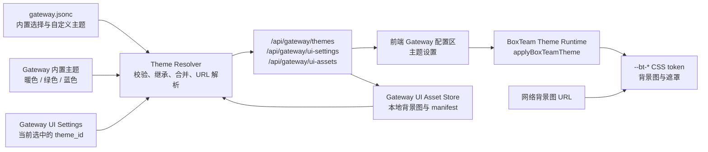
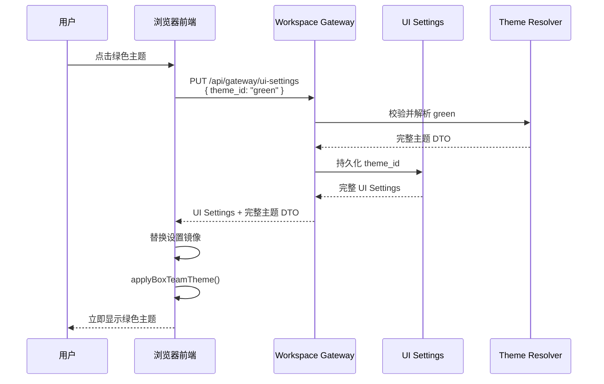
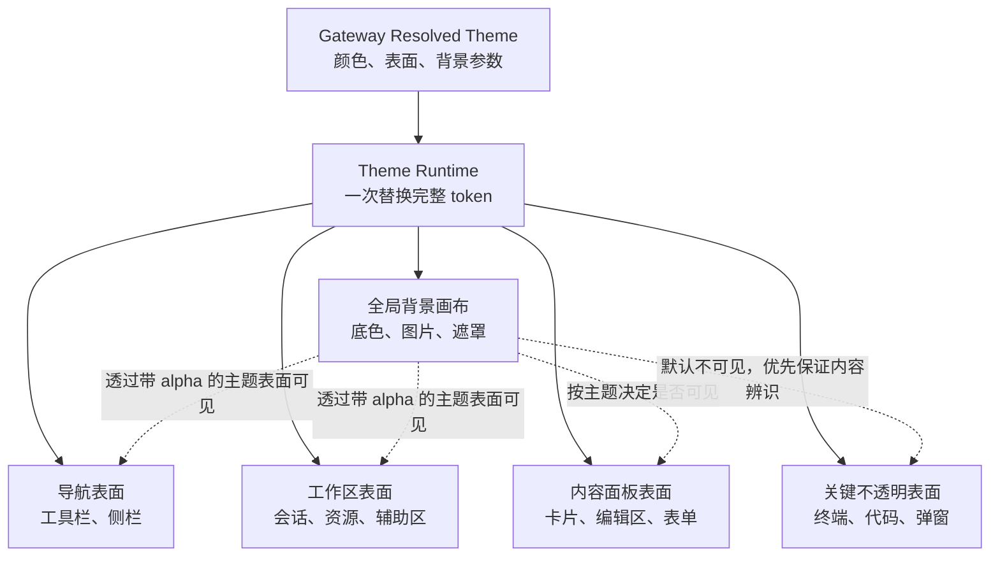

# 统一主题与背景资源管理设计决策

> **决策状态**：拟定  
> **适用范围**：Workspace Gateway、浏览器前端、Gateway 配置中心、主题配置、背景图资源  
> **核心决策**：Gateway 是主题配置和背景资源的唯一权威来源；前端只消费 Gateway 返回的完整主题对象并维护展示态

---

## 1. 背景

浏览器前端已将主要颜色、字体、边框、状态色和背景图入口收敛为 `--bt-*` CSS token，并已具备运行时应用主题 token 和单张背景图 URL 的基础能力。但是，当前尚缺少完整的主题管理链路：

1. 前端没有可视化的主题设置入口。
2. Gateway 的 UI Settings 没有主题选择字段。
3. `gateway.jsonc` 无法快速声明自定义主题。
4. 本地背景图没有可供浏览器访问的 Gateway URL。
5. 网络 URL、本地文件和 Gateway 已管理资源的语义没有分离。
6. 只有默认暖色视觉，没有可立即切换的绿色和蓝色默认主题。

主题是跨工作区的全局 UI 配置，不属于 Agent 业务状态，也不应由任意工作区后端管理。因此，本设计将主题定义、当前选择、背景资源和对外 URL 统一收敛到 Gateway 全局控制面。

---

## 2. 目标

本设计必须同时满足：

1. 用户可以在前端 Gateway 配置区域一键切换主题。
2. 内置三套可立即使用的主题：暖色、绿色和蓝色，默认使用暖色。
3. 用户可通过 `gateway.jsonc` 快速添加或调整自定义主题。
4. 主题可覆盖任意 `--bt-*` token，并能基于内置主题做少量覆盖。
5. 背景图同时支持网络 URL、Gateway 管理的本地资源和配置文件导入的本地文件。
6. 主题切换不需要刷新页面。
7. 切换成功后，前端必须使用 Gateway 返回的完整对象替换本地镜像。
8. 失败时显式报错，不伪造已切换成功的前端状态。
9. 本地资源使用稳定 ID 和同源 URL，不向前端暴露本地绝对路径。

---

## 3. 非目标

1. 本阶段不将主题配置放入工作区 `.boxteam/` 目录。
2. 不由工作区 FastAPI 后端代理主题或背景图。
3. 不允许浏览器通过 API 任意读取本地绝对路径。
4. 不要求 Gateway 代理所有网络背景图；默认由浏览器直接访问远程 URL。
5. 本阶段不处理 `src/webview-ui/` 的主题同步。
6. 不引入主题市场、在线下载或远程主题代码执行。

---

## 4. 总体架构



数据责任边界：

- `gateway.jsonc` 管理可配置的主题目录、自定义 token、启动默认主题和可选背景。
- Gateway UI Settings 管理用户当前选中的 `theme_id`。
- Gateway UI Asset Store 管理已导入的本地背景图和稳定资源 ID。
- Theme Resolver 合并内置主题、自定义覆盖和当前选择，产生前端可直接应用的完整主题对象。
- 前端不合并主题、不解析本地路径，只应用 Gateway 的最终结果。

---

## 5. 权威数据与配置优先级

### 5.1 单一权威原则

Gateway 是对前端的唯一主题权威来源。虽然 Gateway 内部会读取多个物理来源，前端只能看到 Theme Resolver 输出的一个完整对象，不能自行推导优先级。

### 5.2 解析优先级

当前主题 ID 按以下顺序解析：

1. Gateway UI Settings 中用户最后成功选择的 `theme_id`。
2. `gateway.jsonc` 中的 `ui.theme.default_theme_id`。
3. 内置默认值 `warm`。

主题 token 按以下顺序合并，后者覆盖前者：

1. 主题 `extends` 指向的内置基础主题。
2. `gateway.jsonc` 中该主题声明的 `tokens`。
3. 主题中的背景图展示参数。

如果选中的主题不存在、继承链成环、token 名称非法或背景资源不存在，Gateway 必须返回详细错误，不得静默回退到暖色主题。

---

## 6. 主题数据模型

### 6.1 主题定义

```typescript
interface GatewayThemeDefinition {
  id: string;
  label: string;
  extends: "warm" | "green" | "blue";
  color_scheme: "light" | "dark";
  tokens: Record<`--bt-${string}`, string>;
  background: GatewayThemeBackground | null;
}
```

约束：

- `id` 是稳定标识，不使用显示名生成。
- `tokens` 的键必须以 `--bt-` 开头。
- `extends` 本阶段只允许指向三套内置主题，避免任意长继承链。
- Gateway 必须返回合并后的完整 token，前端不处理 `extends`。
- 空 token 值应拒绝，不表示删除或回退。

### 6.2 背景图定义

```typescript
type GatewayThemeBackground =
  | {
      type: "remote";
      url: string;
      position: string;
      size: string;
      repeat: string;
      overlay: string;
      appearance: "immersive" | "theme";
    }
  | {
      type: "gateway_asset";
      asset_id: string;
      position: string;
      size: string;
      repeat: string;
      overlay: string;
      appearance: "immersive" | "theme";
    };
```

`gateway.jsonc` 额外支持一种仅用于本地配置导入的输入形态：

```jsonc
{
  "type": "local_file",
  "path": "/home/user/Pictures/background.webp",
  "position": "center",
  "size": "cover",
  "repeat": "no-repeat",
  "appearance": "immersive"
}
```

Gateway 读取配置时必须将 `local_file` 导入 UI Asset Store，并在对外 DTO 中转换为 `gateway_asset`。前端永远不接收 `local_file` 或绝对路径。

`appearance` 决定背景启用后的界面调色方式：

- `immersive`：默认值。参考图片主题方案，切换到独立的深色中性背景调色板；当前暖色、绿色或蓝色主题只保留 accent、操作色和状态色，不再用大面积主题底色覆盖图片。暖色使用暖橙色强调，绿色使用森林绿，蓝色使用深蓝色，不能因为沉浸层而统一变成蓝色。
- `theme`：保留当前主题的完整配色，只使用其语义表面透明度显示图片，适合浅色或与主题同色系的背景。

沉浸调色板必须同时覆盖画布、表面、文字、边框、输入、菜单、代码和浮层颜色，不能只把表面改暗而保留浅色主题文字。移除背景后必须立即恢复用户原先选择的完整主题 token。

### 6.3 前端最终主题 DTO

```typescript
interface ResolvedGatewayThemeDTO {
  id: string;
  label: string;
  color_scheme: "light" | "dark";
  tokens: Record<`--bt-${string}`, string>;
  background_image_url: string | null;
}
```

`background_image_url` 只能是：

- 经校验的 `http://` 或 `https://` 网络 URL。
- Gateway 生成的同源 `/api/gateway/ui-assets/{asset_id}` URL。
- `null`，表示不使用背景图。

---

## 7. 三套内置主题

Gateway 必须内置三套完整主题，并保证每套都定义所有前端必需 token。

| 主题 ID | 显示名 | 主要特征 | 默认背景 |
|---|---|---|---|
| `warm` | 暖色 | 米白、浅黄棕表面，暖橙色操作色 | 无图片，使用柔和径向渐变 |
| `green` | 绿色 | 浅灰绿表面，森林绿操作色 | 无图片，使用低饱和绿色渐变 |
| `blue` | 蓝色 | 浅灰蓝表面，深蓝操作色 | 无图片，使用低饱和蓝色渐变 |

内置主题是 Gateway 发布产物的一部分，不要求用户在 `gateway.jsonc` 中复制完整 token。自定义主题应通过 `extends` 从其中一套开始，只覆盖需要变更的 token。

---

## 8. `gateway.jsonc` 快速配置

建议在 Gateway 用户配置中新增 `ui.theme` 节：

```jsonc
{
  "ui": {
    "theme": {
      // 当 UI Settings 还没有用户选择时使用。
      "default_theme_id": "warm",

      // 只需写与内置主题不同的部分。
      "custom_themes": [
        {
          "id": "warm-wallpaper",
          "label": "暖色壁纸",
          "extends": "warm",
          "color_scheme": "light",
          "tokens": {
            "--bt-panel-background": "rgba(255, 248, 232, 0.88)",
            "--bt-surface-raised": "rgba(255, 250, 240, 0.92)"
          },
          "background": {
            "type": "local_file",
            "path": "/home/user/Pictures/warm-background.webp",
            "position": "center",
            "size": "cover",
            "repeat": "no-repeat",
            "overlay": "linear-gradient(rgba(242, 236, 217, 0.30), rgba(242, 236, 217, 0.30))"
          }
        },
        {
          "id": "green-network",
          "label": "绿色网络背景",
          "extends": "green",
          "color_scheme": "light",
          "tokens": {
            "--bt-accent": "#287a55"
          },
          "background": {
            "type": "remote",
            "url": "https://example.com/backgrounds/forest.webp",
            "position": "center",
            "size": "cover",
            "repeat": "no-repeat",
            "overlay": "linear-gradient(rgba(235, 245, 238, 0.36), rgba(235, 245, 238, 0.36))"
          }
        }
      ]
    }
  }
}
```

配置约束：

1. `default_theme_id` 必须引用已存在的内置或自定义主题。
2. 自定义主题 ID 不得与内置 ID 重复，避免升级后语义变化。
3. 非 `--bt-*` token 必须拒绝。
4. 不支持在 token 中注入任意 CSS 规则；每个值只是单个自定义属性值。
5. 配置重载时，必须先完整校验新主题目录，成功后才原子替换当前目录。
6. 重载失败必须保留上一份有效目录并报告详细错误，不得将无效配置显示为已生效。

---

## 9. Gateway 存储设计

### 9.1 存储位置

主题和 UI 背景图属于 Gateway 全局控制面，必须位于 `${BOXTEAM_HOME:-~/.boxteams}/` 下，不得写入任意工作区的 `.boxteam/`。

建议物理布局：

```text
${BOXTEAM_HOME:-~/.boxteams}/
├── config/
│   └── gateway.jsonc
└── state/
    └── gateway/
        ├── web_ui_settings.json
        └── ui-assets/
            ├── manifest.json
            └── {asset_id}/
                └── original.{ext}
```

`manifest.json` 至少记录：

- `asset_id`
- 原始文件名
- MIME type
- 文件大小
- 内容摘要
- 导入时间
- 当前引用该资源的主题 ID

### 9.2 导入规则

- Gateway 配置中的 `local_file` 路径是受信任的本地管理员输入，Gateway 在解析配置时显式导入。
- 前端上传使用文件内容，不接受前端提交任意本地路径让 Gateway 读取。
- 只允许明确支持的图片 MIME type，并限制单文件大小。
- 资源 ID 必须与原始文件名和本地路径解耦。
- 相同内容可根据内容摘要去重。
- 文件丢失、MIME type 不符或读取失败时必须拒绝主题配置，不得返回虚假的资源 URL。

---

## 10. Gateway API

### 10.1 主题查询

```text
GET /api/gateway/themes
```

返回：

- 当前主题 ID。
- 可选主题的 `id` 和 `label`。
- 当前已解析的完整主题 DTO。
- 每个主题的来源：`builtin` 或 `gateway_config`。

### 10.2 切换主题

```text
PUT /api/gateway/ui-settings
```

扩展现有 UI Settings 更新对象：

```json
{
  "theme": {
    "theme_id": "green"
  }
}
```

成功响应必须返回完整 UI Settings，并包含完整的已解析主题 DTO。前端用响应完全替换本地镜像，然后调用 `applyBoxTeamTheme()`。

### 10.3 上传本地背景图

```text
POST /api/gateway/ui-assets
Content-Type: multipart/form-data
```

成功时返回资源 DTO 和同源 URL。上传只创建资源，不自动修改当前主题；主题变更必须通过明确的设置更新完成。

### 10.4 获取本地资源

```text
GET /api/gateway/ui-assets/{asset_id}
```

要求：

- 根据 manifest 解析资源，禁止将 `asset_id` 当作路径片段直接拼接。
- 返回正确的 `Content-Type`、`Content-Length`、`ETag` 和合理的缓存头。
- 资源不存在或 manifest 与物理文件不一致时返回详细错误。
- 该端点不得读取 UI Asset Store 以外的文件。

### 10.5 删除资源

```text
DELETE /api/gateway/ui-assets/{asset_id}
```

被任何主题引用的资源必须拒绝删除，并在错误中列出引用它的主题 ID。不得删除资源后静默移除主题背景。

---

## 11. 前端 Gateway 主题设置

主题设置放在 Gateway 配置区域，不放在工作区业务设置中。

### 11.1 快速切换区

顶部始终展示三张内置主题卡片：

- 暖色（默认）
- 绿色
- 蓝色

每张卡片包含名称、简化色板预览和当前选中标识。点击卡片后：

1. 调用 Gateway API 更新 `theme_id`。
2. 等待 Gateway 返回完整 UI Settings 和已解析主题。
3. 使用响应完全替换前端设置镜像。
4. 调用 `applyBoxTeamTheme()` 立即替换 token 和背景图。
5. 更新浏览器 `meta[name="theme-color"]`。

请求完成前显示明确的忙碌状态。请求失败时，主动重新获取 Gateway UI Settings，并显示详细错误；不得仅切换 React 本地状态伪造成功。

### 11.2 自定义主题区

自定义主题列表展示 `gateway.jsonc` 中的所有自定义主题。前端本阶段只负责：

- 查看主题名称和基础主题。
- 预览关键颜色和背景图。
- 切换到自定义主题。
- 打开配置文件所在位置或复制配置示例。

主题 token 的权威编辑仍通过 `gateway.jsonc` 完成，避免前端和配置文件同时维护两份可编辑主题定义。

### 11.3 背景图区

背景图设置支持：

- 使用当前主题默认背景。
- 输入网络 URL。
- 上传本地图片到 Gateway。
- 选择 Gateway 已管理的背景资源。
- 配置 `position`、`size`、`repeat` 和 `overlay`。
- 移除背景图。

上传成功后必须再显式保存主题设置，不得因上传完成而自动改变当前主题。

---

## 12. 快速切换时序



切换过程不卸载 React 应用，不重载页面，不逐个组件更新颜色。只替换根节点的整套 `--bt-*` token、`color-scheme`、背景 URL 和背景展示参数。

---

## 13. 前端运行时要求

1. `theme.css` 只定义结构性默认值和 token 应用规则，三套完整颜色主题由 Gateway Theme Resolver 返回。
2. 所有颜色字面量保持在主题定义内，业务 CSS 只使用 `--bt-*` token 和基于 token 的 `color-mix()`。
3. `applyBoxTeamTheme()` 接收完整主题 DTO，必须清理上一主题注入的 token。
4. 主题切换不得依赖 VS Code `--vscode-*` 变量。
5. 背景图 URL 必须使用标准 CSS URL 转义，不得字符串拼接未转义内容。
6. 切换主题时必须同步更新 `color-scheme` 和 `meta[name="theme-color"]`。
7. 初始页面显示前应尽早获取并应用 Gateway 主题，减少默认主题闪烁。
8. 如果 Gateway 主题获取失败，前端必须显示初始化错误，不得静默伪装成已读取用户主题。

### 13.1 背景画布与主题表面分层

背景图不是某个侧栏或局部组件的装饰，而是整个应用工作台的全局画布。前端必须把“背景画布”和“承载内容的主题表面”作为两个独立层级处理：

1. `.app-shell` 是唯一的背景画布，负责绘制主题底色、背景图片和全局背景遮罩。
2. 页面内的布局容器不得自行重复绘制背景图片。
3. 布局容器必须按语义使用统一的主题表面 token，不得直接选择某个基础颜色 token 来决定是否遮住背景。
4. 背景可见性通过表面自身带 alpha 的颜色控制，不得对容器使用 `opacity`，避免文字和交互控件一起变透明。
5. `backdrop-filter` 只属于主题表面表现，不参与业务布局；不支持该能力的浏览器仍必须通过表面颜色保证文字对比度。
6. 没有配置背景图时，同一套表面 token 仍必须形成完整、可读的普通主题，不能依赖图片填补视觉层级。



### 13.2 统一表面 token

完整主题 DTO 除基础色 token 外，必须提供以下语义表面 token：

| token | 语义 | 默认要求 |
| --- | --- | --- |
| `--bt-canvas-background` | 图片加载前和无图片时的全局画布底色 | 不透明 |
| `--bt-chrome-surface` | 顶部工具栏、主导航、工作区侧栏 | 背景可辨识、允许图片透出 |
| `--bt-workspace-surface` | 会话工作台、资源工作区、辅助工作区 | 允许图片适度透出 |
| `--bt-panel-surface` | 面板、卡片、编辑区和配置区 | 比工作区表面更实，保持内容层级 |
| `--bt-floating-surface` | 菜单、下拉框、提示层、悬浮面板 | 高不透明度 |
| `--bt-critical-surface` | 终端、代码阅读区和需要稳定对比度的内容 | 默认不透明 |
| `--bt-surface-backdrop-filter` | 导航表面的基础模糊、饱和度策略 | 可配置，允许为 `none` |
| `--bt-chrome-backdrop-filter` | 导航表面的最终滤镜 | 默认继承基础滤镜 |
| `--bt-workspace-backdrop-filter` | 工作区表面的最终滤镜 | 默认 `none`，避免大面积模糊吞没背景结构 |

这些 token 是主题契约的一部分，三套内置主题必须完整提供。自定义主题继承内置主题后可以集中覆盖它们，从而改变整个应用的背景显露程度，而不需要修改组件 CSS。

旧的 `--bt-page-background`、`--bt-panel-background`、`--bt-surface-background` 等基础色仍可用于绘制控件内部细节，但不能再由顶层布局容器直接用来决定全局表面的不透明度。迁移完成后，顶层布局只消费上述语义表面 token。

### 13.3 组件表面归属

前端必须维护稳定的表面角色，而不是逐个为背景图编写例外规则：

| 表面角色 | 典型区域 | 约束 |
| --- | --- | --- |
| 背景画布 | 应用根节点 | 唯一允许绘制用户背景图的层 |
| 导航表面 | 顶部工具栏、会话导航、资源导航 | 各区域连续一致，不因组件边界产生不规则透明块 |
| 工作区表面 | 主会话区、文件与变更区、右侧辅助区 | 背景在主要空白区域可感知，不能只在边角或单个侧栏出现 |
| 内容面板表面 | 消息卡片、设置卡片、表单、预览容器 | 与工作区有明确层级，同时保持正文可读 |
| 浮动表面 | 菜单、下拉框、对话框、提示 | 不应因下方图片造成选项难以辨认 |
| 关键表面 | 终端、代码块、差异查看器 | 优先采用稳定不透明背景，不要求透出图片 |

新增或重构顶层 UI 容器时，必须先选择一个表面角色；业务组件不得通过新增任意 `rgba(...)`、局部透明度或背景图片规则绕过该模型。

布局宿主只负责排列上述区域，必须保持透明，不能再套用工作区或内容面板表面。主会话区、文件预览区和右侧辅助区分别直接拥有一个工作区表面，避免“工作区套内容面板”造成 alpha 连乘；只有消息、表单、设置卡片等真实内容单元使用内容面板表面。

### 13.4 可读性和可访问性

1. 内置主题的表面颜色必须在浅色、高对比度和细节密集的背景图上都能保证主要文字、次要文字、边框和选中态可辨认。
2. 全局 `overlay` 负责控制图片整体强度，表面 token 负责建立 UI 层级，两者不能互相替代。
3. 交互状态不得仅依赖背景透明度差异，仍需使用边框、文字色或状态色表达。
4. 用户显式将 `overlay` 设置为 `none` 时，主题表面仍需提供最低可读性保障。
5. 背景图片加载失败时必须显示错误；已应用的主题表面和画布底色继续正常显示，但不得把加载失败报告为成功。

---

## 14. 缓存与性能

1. 内置和自定义主题解析结果由 Gateway 按配置版本缓存。
2. 主题切换只修改 UI Settings 中的主题 ID，不重新导入未变化的本地图片。
3. Gateway 本地资源使用内容摘要生成 ETag，浏览器可长时间缓存。
4. 背景图切换允许浏览器自然异步加载；前端可预加载目标图片，成功后再应用主题，但加载失败必须可见。
5. 远程图片默认不经 Gateway 代理，避免不必要的带宽、缓存和 SSRF 责任。

---

## 15. 校验与安全

### 15.1 主题配置

- 主题 ID 使用有界的字母、数字、连字符和下划线。
- token 键必须属于 Gateway 发布的 `--bt-*` 白名单，不仅检查前缀。
- token 值必须通过按类型的 CSS 值校验；颜色 token、尺寸 token 和背景 token 不共用无约束字符串。
- 不允许 token 值中嵌入外部任意 CSS URL；背景图 URL 只能通过结构化 `background` 字段输入。

### 15.2 本地资源

- 只从 manifest 映射 `asset_id` 到物理文件。
- 禁止路径穿越、符号链接逸出和任意文件名拼接。
- 上传和配置导入都必须校验 MIME type、扩展名、内容摘要和大小上限。
- SVG 默认不作为可上传背景格式；如后续支持，必须有独立的内容净化设计。

### 15.3 网络 URL

- 默认只允许 `http` 和 `https`。
- 拒绝 `file:`、`javascript:` 和未识别 scheme。
- 网络 URL 由浏览器直接加载时，Gateway 不对远程内容可用性做虚假承诺。
- 如未来增加 Gateway 远程代理或下载功能，必须另行设计 SSRF 防护、大小限制、超时和重定向校验。

---

## 16. 错误处理

必须显式报告以下错误：

- 配置的默认主题 ID 不存在。
- 自定义主题 ID 重复。
- `extends` 引用非法基础主题。
- token 名称未知或 token 值非法。
- 背景图 URL scheme 不支持。
- 本地文件不存在、无法读取或格式不支持。
- Gateway 资源 manifest 与物理文件不一致。
- 主题切换持久化失败。
- 背景图预加载失败。

失败后，前端必须从 Gateway 重新获取完整 UI Settings 和当前主题，不得保留只存在于 React 本地状态的伪选中结果。

---

## 17. 测试要求

### 17.1 Gateway 单元测试

- 三套内置主题都能解析为完整 token。
- 默认主题是 `warm`。
- UI Settings 选择覆盖 `gateway.jsonc` 默认值。
- 自定义主题正确继承并覆盖内置主题。
- 未知 token、重复 ID、非法继承和空 token 值明确失败。
- 本地图片导入生成稳定资源 ID 和 manifest。
- 资源获取不能越过 UI Asset Store 边界。
- 被引用的资源拒绝删除。

### 17.2 前端单元测试

- 完整主题 DTO 可一次应用所有 token。
- 切换时清理上一主题 token 和背景图。
- 网络 URL 和 Gateway 同源 URL 都能正确转义。
- 切换后同步更新 `color-scheme` 和 `meta[name="theme-color"]`。
- API 失败后重新拉取 Gateway 状态，不保留乐观伪状态。
- 三套内置主题都提供完整的语义表面 token。
- 顶层布局容器使用语义表面 token，不直接退回不透明基础色。

### 17.3 Web 端到端测试

- 从 Gateway 配置区依次切换暖色、绿色和蓝色，并校验关键 CSS token。
- 刷新页面后保留最后成功选择的主题。
- 上传本地背景图、选择该资源并刷新页面后仍能加载。
- 配置网络 URL 背景并验证切换。
- 将 Gateway 资源文件移除后，前端显示可见错误，不显示虚假成功状态。
- 使用高对比度测试图片检查顶部、左侧、主工作区和右侧辅助区，背景必须在主要工作台范围内连续可感知，不能只在单个组件或边角出现。
- 检查消息、表单、菜单、终端和代码区域的文字可读性；关键表面不得为了显露背景而失去稳定对比度。
- 分别验证默认遮罩和显式 `overlay: "none"`，两种状态下交互控件都必须可辨认。
- 移除背景图后再次遍历主要工作台，确认表面层级完整且没有因透明化出现视觉空洞。

前端测试修改 `src/clients/web/` 后必须执行 `bun run --cwd src/clients/web build`。

---

## 18. 建议实施顺序

1. 在 Gateway schema 和 `gateway.jsonc` schema 中增加主题定义。
2. 实现三套内置主题和 Theme Resolver。
3. 扩展 Gateway UI Settings，保存当前 `theme_id`。
4. 实现 UI Asset Store、manifest 和资源 API。
5. 实现 `gateway.jsonc` 本地图片导入。
6. 对接前端初始主题获取和运行时快速切换。
7. 建立语义表面 token，并按表面角色迁移所有顶层布局容器。
8. 在 Gateway 配置区增加主题设置、三套快速切换卡片和背景图管理。
9. 补齐单元测试、Gateway API 测试和 Web 端到端视觉验收。

---

## 19. 验收标准

全部满足以下条件后，本设计才视为完成：

1. 首次启动默认使用暖色主题。
2. Gateway 配置区可无刷新切换暖色、绿色和蓝色主题。
3. 刷新页面和重启 Gateway 后保留用户最后选择。
4. `gateway.jsonc` 可通过继承内置主题和少量 token 覆盖定义自定义主题。
5. 网络 URL 背景图可使用。
6. 本地图片可导入 Gateway，并通过稳定同源 URL 使用。
7. 前端不保存或解析本地绝对路径。
8. 业务 CSS 不新增颜色字面量或 `--vscode-*` 依赖。
9. 所有配置、资源和持久化错误都向用户显式报告。
10. 背景图在顶部、导航、主工作区和辅助工作区形成连续的全局视觉效果，不得仅在局部组件或边角可见。
11. 顶层布局统一使用语义表面 token；自定义主题可以只覆盖这些 token 就调整全局背景显露程度。
12. 浮动表面和关键内容表面保持稳定可读，显式关闭全局遮罩也不会破坏基本操作。
