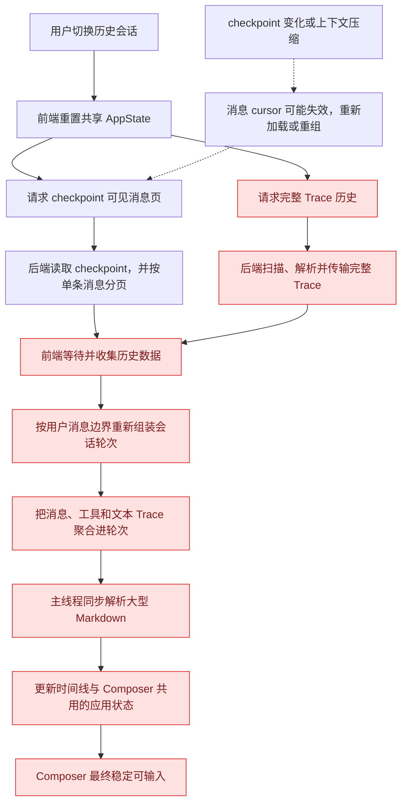
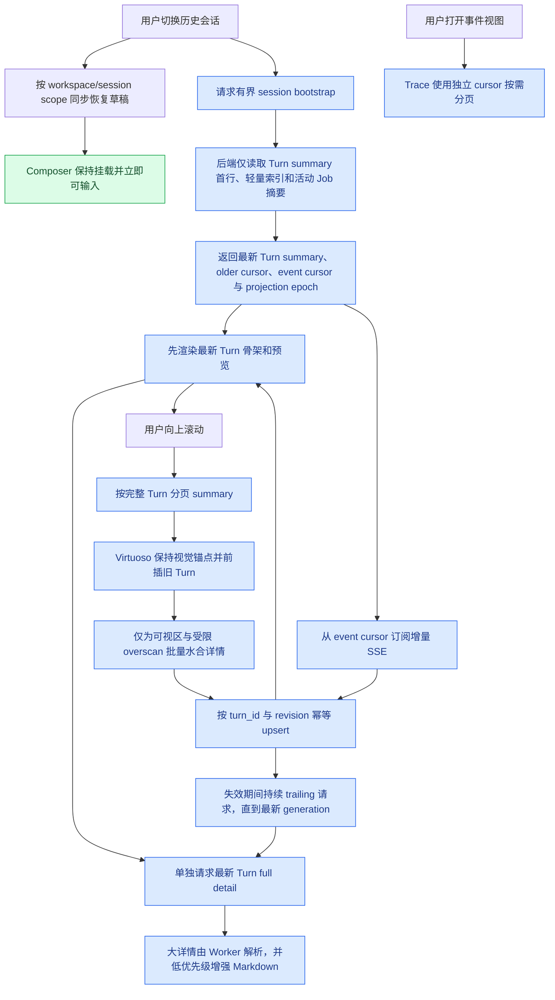

## Context

当前浏览器时间线通过 checkpoint 可见消息分页，在前端再按用户消息边界组装会话轮次；会话切换还会恢复完整 Trace。该路径把模型上下文、调试事件和用户可见历史耦合在一起：checkpoint 变化会使 cursor 失效，长 Trace 会增加首屏读取与 JSON 处理成本，大型 Markdown 会在主线程同步解析，而 Composer 订阅完整应用状态并随时间线更新重渲染。

后端已有 Job ID、消息/工具/文本/终态事件、会话内 JSONL 存储和 SSE；前端已有 Virtuoso、顶部锚点保持和 session-scoped 草稿。这次变更在这些能力上建立独立的展示读取模型，不改变 checkpoint 作为模型输入上下文权威来源的职责，也不把业务状态放入 Gateway。

## 加载流程对比

### 旧版：从 checkpoint 与完整 Trace 动态重建时间线

旧版把模型上下文、调试 Trace、展示分组和 Markdown 渲染串入同一条首屏路径；历史越长，Composer 越晚进入稳定状态，而且分页单位仍是单条消息而不是完整 Job Turn。

### 新版：Composer 独立启动，Turn 时间线渐进加载

新版把输入关键路径与历史读取彻底解耦：bootstrap、分页和详情请求都有固定上限，最新 Turn 优先呈现；旧历史以完整 Turn 为单位加载，Trace 只在诊断视图中独立分页。

## Goals / Non-Goals

**Goals:**

- 会话切换后不等待任何历史网络请求即可稳定输入，时间线更新不使 Composer 重渲染。
- 使用执行 Job 作为权威 Turn 边界，优先加载最新 Turn，并以完整 Turn 分页。
- 普通追加、Job 状态更新和上下文压缩不使旧分页 cursor 失效。
- 初始加载的数据量有上限，不扫描完整 checkpoint 或完整 Trace。
- 大型 Markdown 的传输、水合和渲染不阻塞 Composer。
- bootstrap、分页、终态协调和 SSE 通过可验证的 revision 规则无损合并。

**Non-Goals:**

- 不更换 checkpoint、LangGraph 或模型上下文压缩实现。
- 不删除完整 Trace 或调试事件面板；Trace 改为独立按需分页。
- 不保证无限大最新回答能在单帧内完成网络传输和 Markdown 渲染；保证的是 Composer 与 Turn 骨架先可用。
- 不引入数据库、消息队列或 Gateway 业务存储。

## Decisions

### 1. 使用 Job-centric Turn 投影作为展示历史

新增会话内 `TurnHistoryStore`，由 `MESSAGE_CREATED`、Job 生命周期、`TEXT_END`、工具调用终态等语义事件增量更新。Turn 使用实际执行 `job_id` 作为 `turn_id`，同时保存 `source_message_ids` 和 `merged_job_ids`，以表示 steering 合并形成的一次执行。

投影采用 append-only operation log、offset/index 和小型原子 manifest；达到阈值后压实为快照。每个 operation 以事件 ID 和单调 source offset 幂等应用，低水位重放必须在写 WAL 前短路。单个 Turn 文件使用原子发布的两段记录：固定上限的首行保存 summary、可见性和 timeline anchor，第二段才保存完整 detail；bootstrap、分页和常规恢复只读取首行。manifest 保存最新 ordinal、投影 epoch 和恢复水位。投影文件位于统一会话节点中，并通过会话路径解析器定位。

替代方案是每次从 checkpoint 和 Trace 动态分组。该方案无需新存储，但读取成本随历史增长、无法提供稳定 cursor，也把展示历史继续绑定到模型上下文，因此不采用。

### 2. bootstrap 只返回有界骨架，最新详情独立水合

新增 `GET /api/v1/sessions/{session_id}/bootstrap`，返回 session shell、最新 Turn summary、活动/排队 Job 摘要、`older_cursor`、`event_cursor` 和 `projection_epoch`。summary 的文本预览和 item 数量有固定上限，接口不得读取完整 checkpoint 或完整 Trace。

前端获得 bootstrap 后立即请求最新 Turn 的 full detail；历史列表使用 `GET /sessions/{id}/turns?items_view=summary`，可视区域使用批量 detail API 水合。这样最新 Turn 优先，但极端大回答不会阻塞 session shell 和 Composer。

会话切换、手动重载和 scope 变化会取消旧 bootstrap、分页与详情请求。详情失效采用按 Turn 递增的 generation：若失效到达时已有请求在途，至少再发一次 trailing 请求；trailing 请求期间再次失效时继续追取，直到已满足最新 generation，避免终态或 SSE 更新被旧响应吞掉。

### 3. cursor 使用稳定 Turn 锚点和显式投影 epoch

cursor 是不透明编码，内部包含 `projection_epoch`、`anchor_turn_id`、`include_anchor` 和方向。正常追加 Turn、Turn revision 更新、checkpoint 写入与上下文压缩不改变 epoch；删除、回滚、历史重排或无法保持 Turn 身份的投影重建必须递增 epoch。旧 epoch 请求返回明确的 stale-cursor 错误，不能静默退回第一页。

每个 Turn 保存单调递增 `revision`。客户端仅接受同一 `turn_id` 的更高 revision，等 revision 必须幂等。

### 4. 活动 Job 通过持久投影与实时状态合并

已完成历史来自 Turn store；当前活动 Job 的未持久化细节从 Job/EventBus 状态合并。bootstrap 捕获事件水位后返回 `event_cursor`，前端从该水位订阅 SSE，并按照 event ID 与 Turn revision 去重。SSE `id` 是与业务 event ID 分离的 transport cursor，携带可有界校验的 Trace byte range；收到任意 `text_delta` 后的重连都不得扫描完整 Trace。即使 bootstrap、详情请求和 SSE 乱序到达，也不得覆盖较新的状态。

终态展示必须区分失败与取消：`session_interrupted` 表示用户主动中断，使用中性“已由用户中断”状态；只有真实 `error`/`job_failed` 才使用运行失败样式。伴随用户中断产生的 `job_cancelled` 不得重复渲染第二个取消状态。

### 5. Composer 与时间线状态物理解耦

Composer 使用独立 Context/store selector，只订阅当前 workspace/session、草稿、附件、发送/控制状态和必要配置。切换会话时同步按 scope 读取草稿，Composer DOM 保持挂载；历史 loading、分页、Trace 和文本 delta 不进入其订阅值。

时间线使用按 workspace/session 分区的 LRU：`orderedTurnIds`、`turnsById`、cursor、epoch 和加载 phase。所有来源统一 upsert，不允许终态协调用最新页替换已加载集合。

### 6. Markdown 使用两阶段渲染

Turn summary 和 detail 到达时先提交轻量文本/骨架；超过固定阈值的 detail JSON 在按需 Web Worker 中解码和解析，ReactMarkdown 增强通过低优先级 transition 或浏览器调度执行。超大 Markdown 先增强固定长度且固定高度的格式化预览，完整 Markdown 只在用户明确展开后解析，避免后台增强使时间线突然膨胀。Turn 和 Markdown 组件以 `turn_id + revision + content identity` memoize，只为 Virtuoso 可见区及少量 overscan 水合 full detail。折叠的 reasoning、大型工具输出和超大用户输入在展开前不得挂载完整内容。

### 7. Trace 与聊天时间线拆分

会话切换不再调用无 `tail_limit` 的完整 Trace 恢复。主聊天只消费 bootstrap/SSE 所需的有界事件；事件面板打开时使用自身 cursor 分页。现有完整 Trace 文件继续作为诊断数据保留。

### 8. 破坏性 replay 同步回退上下文与展示投影

编辑并从此处继续、重新生成和失败重试先确认会话无活动 Job，再以目标用户消息为边界追加截断后的模型 checkpoint，并在 dispatch 新 Job 前原子发布隐藏目标 Turn 及其后缀的新展示投影。前端收到 replay 响应后重新 bootstrap；新投影 epoch 使旧分页 cursor 明确 stale，缓存不会继续展示已退出上下文的旧分支。工作区文件修改不参与该回退。

破坏性发布的 compare-and-swap 基线必须在同一个 Turn store 锁内原子捕获 `projection_epoch`、业务 `event_id` 与 `source_offset`。migration、显式重建和 replay staging 发布时必须同时校验三者；即使 Trace 水位未变化，只要 epoch 已由另一次回退或重排推进，旧 staging 也必须冲突并放弃发布，不能使旧分支复活。

回退定位使用固定上限 summary/header 分页。隐藏后缀时只读取并改写 Turn header，detail 部分以有界缓冲流式复制，不得把全部历史正文、工具事件和 Trace items 同时反序列化进内存。实时 replay Job 携带已发布的 `turn_projection_epoch`，当它与权威投影一致时跳过第二次历史扫描；从 Trace 执行 destructive rebuild 时 staging epoch 不同，仍按 replay 元数据重建隐藏关系，保证重建不会复活旧分支。

当回退隐藏全部可见 Turn 时，索引允许 `latest_turn_id = null`、`turn_count = 0`，但保留已有 timeline 的 `latest_ordinal` 与 committed size，以保证后续新 Turn 的 ordinal 继续单调递增。

## Risks / Trade-offs

- [没有轻量 index 且尾行超预算的旧 Trace] → bootstrap 先返回 Composer 可用的 `partial` shell，后台流式迁移完成后再发布最新 Turn；不得为满足 latest-first 同步解析超大 JSON 行。新写入会话通过 append-time index 保持 latest-first。
- [现有会话没有 Turn 投影] → 首次访问按最近 Turn 优先进行显式、可观测的增量迁移；迁移失败返回详细错误，不静默回退到全量扫描。测试夹具提供确定性重建入口。
- [旧 checkpoint 与 Trace 在进程崩溃窗口只各自保存了部分事实] → 迁移以 message/job 身份关联已有 Trace Turn，checkpoint assistant 只为尚无终态的实际执行 Job 补齐 completion；`job_merged` 的来源消息关联到执行 Turn。首次投影即使已有新 Trace，也必须探测旧 checkpoint，不能提前标记 ready。
- [投影与 checkpoint/Trace 不一致] → 通过事件 ID、水位和恢复校验检测；只重建展示投影，不修改 checkpoint，无法保持身份时递增 epoch。
- [Job 合并使“一 Job 一 Turn”含义模糊] → Turn ID 使用实际执行 Job，DTO 显式暴露来源消息和被合并 Job。
- [延迟 Markdown 会先显示轻量或有界格式化预览] → 保持文本、复制和滚动可用；超大正文由用户明确展开，避免后台解析造成输入卡顿和滚动跳动。
- [前端状态拆分增加协调复杂度] → 所有业务更新仍由后端对象/revision 驱动，使用单一 upsert reducer 和选择代数测试约束。
- [新投影增加磁盘数据] → 只持久化展示所需语义事件并定期压实，不复制完整 text delta 与完整 Trace。
- [后台 migration/rebuild 与 replay 同水位竞态] → staging CAS 同时校验投影 epoch 与事件水位；旧 staging 检测到任一基线变化后明确冲突并丢弃。
- [编辑靠前消息需要隐藏大量 Turn] → 隐藏路径只处理有界 header 并流式复制 detail，避免完整历史常驻内存。当前原子发布仍需 `copytree` 复制整棵派生投影，因此 replay 的磁盘 I/O 和临时空间与投影总字节数相关；该成本只发生在显式破坏性操作，不进入 bootstrap、分页、详情水合或常规 SSE 路径。

## Migration Plan

1. 增加 Turn schema/store/projector 和协议测试，不切换前端。
2. 增加 bootstrap、Turn 分页/详情 API，并为旧会话提供受测的懒迁移。
3. 引入前端 Turn store 和 API，先替换初始历史/终态协调，再移除主时间线的完整 Trace 恢复。
4. 拆分 Composer 订阅并加入渐进 Markdown 水合。
5. 运行长会话真实浏览器 E2E、构建与静态分析后，删除前端旧 message 主时间线状态和不可达代码。
6. 若需回滚，通过版本回退停止使用新读取模型；Turn 投影是派生数据，可删除后由 Trace/checkpoint 重建，不影响模型上下文。当前版本不保留浏览器旧 message 主时间线兼容分支。

## Open Questions

- 无。默认历史 summary 页为 20 个 Turn，可视 detail 批量最多 4 个；这些限制作为后端常量和测试约束实现，不暴露为模型配置。
